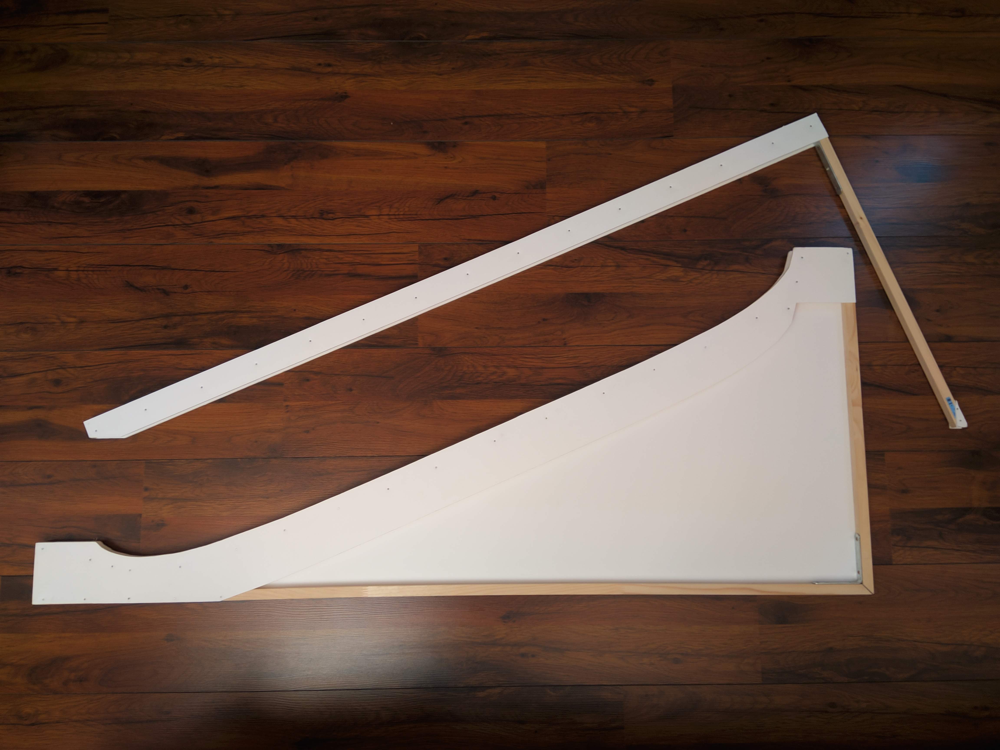

<!-- _paginate: false  -->
<!-- _class: lead  -->

# Gautier Ben Aïm
## La Brachistochrone Réelle
*Informatique et Physique*

---

# Contexte historique
* **1638**, Galilée
* **1696**, Jean Bernoulli
* **1975**, Ashby, Brittin, Love et Wyss
* **1998**, Aleksey Parnovski

---

<!-- _class: lead  -->

# La Brachistochrone Réelle
*Comment construire le meilleur toboggan<br>à l'aide d'un algorithme ?*

---

# Plan de la présentation
1. Création de l'algorithme
2. Construction du meilleur toboggan

---

<!-- _class: codeline -->

Ligne 25

---

<!-- _class: codeline -->

# Méthode d'Euler

$$\begin{pmatrix}x \\ \dot{x}\end{pmatrix}_{t+\mathrm{d}t}\approx\begin{pmatrix}x \\ \dot{x}\end{pmatrix}_t+\begin{pmatrix}\dot{x} \\ \frac{\sum F_{\textit{ext}}}{m} \end{pmatrix}_t\mathrm{d}t$$

Ligne 44

---

<!-- _class: codeline -->

# Algorithme génétique
* Évolution — mutation et croisement
* Sélection

Ligne 111

---


---


---


---


---


---

<!-- _class: codeline -->

# L'algorithme final
* Hybride
* Progresse continuellement

Ligne 229

---

# La brachistochrone *réelle*

```python
def deriver_v():
    return g*sin(θ)
```

$\downarrow$

```python
def deriver_v(v):
    return g*sin(θ) - f*g*cos(θ) - α*v - β*v*v
```

---

<!-- _paginate: false -->


---

# Mesure des coefficients
* $-fg \cos \theta$
* $-\alpha v$
* $-\beta v^2$

---

<!-- _paginate: false -->


---

<!-- _paginate: false -->


---

<!-- _paginate: true -->


---

# Calcul des coefficients
8 mesures + 1 expérience $\rightarrow$ 3 coefficients

---

<!-- _class: codeline -->

# Expression des frottements
$$F = -0.3263 g \cos \theta - 0.0026 v - 0.4748 v^2$$

Ligne 346

---


---

<!-- _paginate: false -->


---

<!-- _paginate: false -->


---

| Toboggan     | $t_c$ (s) | $t_m$ (s) | $U(t_m)$ (s) |
| :----------- | --------: | --------: | -----------: |
| Ligne droite |     1,972 |      2,40 |       ± 0,40 |
| Optimal      |     1,161 |      1,21 |       ± 0,02 |

---

<!-- _class: codeline -->

# Merci de votre attention
Vous avez des questions ?

[tobog.ga](http://tobog.ga)

---

# Annexes

---

<!-- _paginate: false -->


---

| $\theta$ | $l$ (cm) | $t_m$ (ms) | $t_c$ (ms) | $\Delta$ (ms) |
| :------- | -------: | ---------: | ---------: | ------------: |
| 45°      |       50 |        438 |        481 |           −43 |
|          |      100 |        669 |        707 |           −39 |
| 44°      |       50 |        458 |        489 |           −31 |
|          |      100 |        669 |        719 |           −50 |
| 40°      |       50 |        533 |        530 |             3 |
|          |      100 |        780 |        779 |             1 |
| 36°      |       50 |        672 |        626 |            46 |
|          |      100 |        899 |        920 |           −20 |

---


